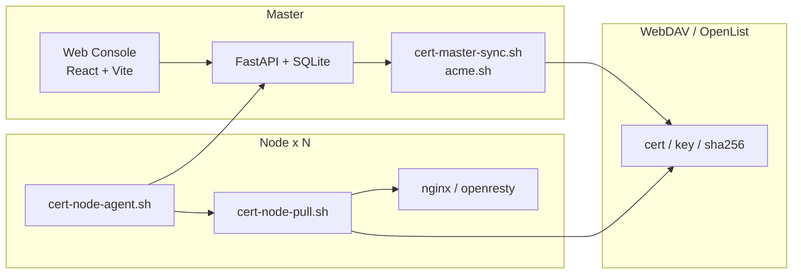

# SSL 证书跨服务器自动同步系统

一个面向自托管场景的 SSL 证书管理系统，核心链路是：

- Master 端统一申请 / 续签证书
- 证书落地到 WebDAV
- Node 端按分配关系拉取、校验、部署并重载服务
- Web 控制台负责管理域名、DNS 渠道、节点、任务、备份与恢复

当前仓库已经不是“演示骨架”，而是可以直接跑起来的一套可用系统。

## 当前能力

- 真实 DNS 渠道测试：调用 `acme.sh --staging`
- 真实 WebDAV 测试：执行 `PUT / GET / DELETE`
- 真实 Telegram 测试：直接调用 Telegram Bot API
- 域名单个 / 批量申请、续签、同步
- Master 端批量操作自动合并 Telegram 汇总消息
- Node 注册、分配域名、批量下发、批量删除节点本地证书
- Node API 模式轮询命令队列，并回传执行结果给 Master
- Node 证书拉取支持 WebDAV 优先、Master API 自动回退
- 设置导出备份、上传备份恢复
- 设置页修改管理员账号密码
- 中英文界面切换
- 本地 Mock 模式前端联调

## 架构



## 仓库结构

| 路径 | 说明 |
| --- | --- |
| `web/frontend` | Web 控制台前端 |
| `web/backend` | FastAPI 后端 |
| `cert-master-sync.sh` | Master 证书申请 / 续签 / 上传脚本 |
| `cert-node-agent.sh` | Node API 轮询代理 |
| `cert-node-pull.sh` | Node 实际拉取与部署脚本 |
| `install.sh` | 传统脚本模式的一键安装 / 更新 / 卸载 |
| `cert-puller.service` / `cert-puller.timer` | Node systemd 单元 |
| `etc_default_acme-master.conf` | Master 脚本配置模板 |
| `etc_default_cert-node.conf` | Node 脚本配置模板 |

## 推荐部署方式：Docker Compose（Master）

### 1. 准备

```bash
git clone <your-repo-url> ssl-sync
cd ssl-sync
cp .env.example .env
```

编辑 `.env`，至少修改：

```env
SSL_SYNC_SECRET_KEY=change-me-before-production
SSL_SYNC_ADMIN_USERNAME=admin
SSL_SYNC_ADMIN_PASSWORD=change-this
```

### 2. 启动

```bash
docker compose up -d --build
```

默认访问地址：

```text
http://<master-ip>:8080
```

### 3. 首次进入 Web 后建议顺序

1. 首次进入时先完成管理员初始化向导
2. 打开“系统设置”
3. 配置：
   - WebDAV
   - Telegram
   - ACME Home / 默认 CA / 账户邮箱
   - Master 对外地址（如果你走反代或域名）
4. 新建 DNS 渠道
5. 新建域名
6. 执行申请 / 续签 / 同步
7. 添加节点并复制接入命令

说明：

- 全新安装且数据库为空时，Web 会先要求设置首个管理员账号密码
- 已有运行数据的升级场景，或你已经通过环境变量设置了非占位管理员密码时，系统会自动沿用现有管理员身份，不会强制弹出首次向导

## Node 接入（推荐走 Web 一键生成命令）

在 Web 后台“节点管理”里点击“添加节点”后，会生成一条可直接在 Node 机器执行的命令，例如：

```bash
curl -fsSL https://ssl.example.com/api/agent.sh | bash -s -- \
  --token 'node_xxx' \
  --master-url 'https://ssl.example.com' \
  --cert-dir '/etc/nginx/ssl'
```

这条命令会自动：

- 安装 `cert-node-agent.sh` 和 `cert-node-pull.sh`
- 写入 `/etc/default/cert-node`
- 安装并启用 `cert-puller.service` / `cert-puller.timer`

安装后可在 Node 上检查：

```bash
systemctl start cert-puller.service
journalctl -u cert-puller -f
```

## 本地开发

### 前端

```bash
cd web/frontend
npm install
VITE_USE_MOCKS=true npm run dev
```

默认开发地址：

```text
http://127.0.0.1:5173
```

### 后端

```bash
cd web/backend
python3 -m venv .venv
source .venv/bin/activate
pip install -r requirements.txt
uvicorn app.main:app --reload --host 127.0.0.1 --port 8080
```

## 传统脚本模式

如果你不走 Web 控制台，也可以继续使用脚本模式：

```bash
bash install.sh
```

支持：

- 安装 Master
- 安装 Node
- 更新脚本 / 配置
- 卸载

相关配置文件：

- `/etc/default/acme-master`
- `/etc/default/cert-node`

## 常用命令

### Master

```bash
docker compose logs -f ssl-sync-master
docker compose up -d --build
```

### Node

```bash
systemctl status cert-puller.timer --no-pager
systemctl start cert-puller.service
journalctl -u cert-puller -n 100 -f
```

### 前端校验

```bash
cd web/frontend
npm run lint
npm run build
```

### 后端校验

```bash
python3 -m compileall web/backend/app
bash -n cert-master-sync.sh
bash -n cert-node-agent.sh
bash -n cert-node-pull.sh
bash -n install.sh
```

## 存储与运行时目录

Docker Compose 默认挂载：

- `./data` -> `/var/lib/ssl-cert-sync`
- `./logs` -> `/var/log/ssl-cert-sync`
- `./config` -> `/etc/ssl-cert-sync`
- `${HOME}/.acme.sh` -> `/root/.acme.sh`

后端镜像内已内置 `acme.sh` 到 `/opt/acme.sh`。如果挂载进来的 `ACME Home` 为空，系统会自动补齐，不需要先手工安装。

## 已知边界

- Node 端不是服务端主动推送，而是 `systemd timer` 轮询命令队列
- 默认轮询频率是 2 分钟一次，`Run Now / 下发 / 删除证书` 会在下一轮尽快落地
- 当前没有完整的自动化端到端测试，合并前建议至少跑一遍文末的校验命令

## 文档索引

- [前端说明](./web/frontend/README.md)
- [后端说明](./web/backend/README.md)
- [实现 walkthrough](./walkthrough.md)
